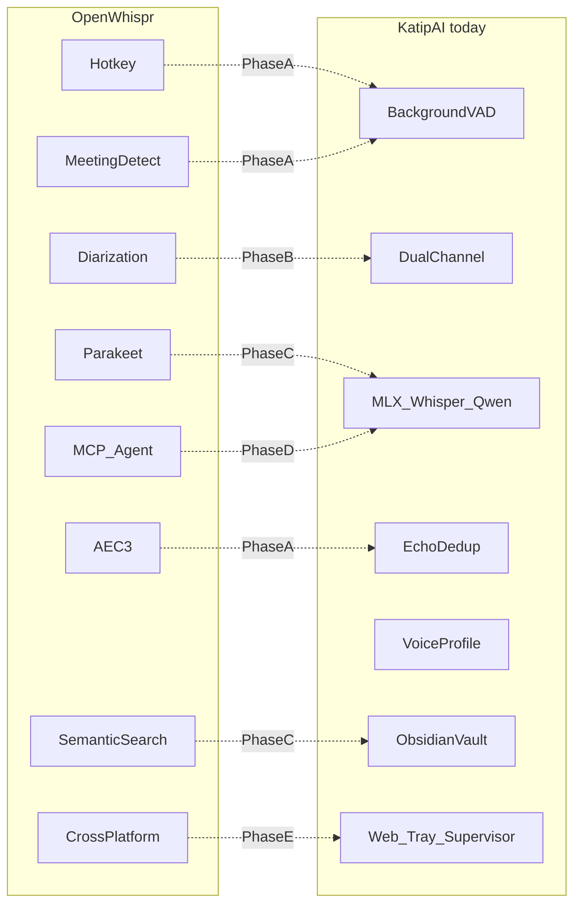
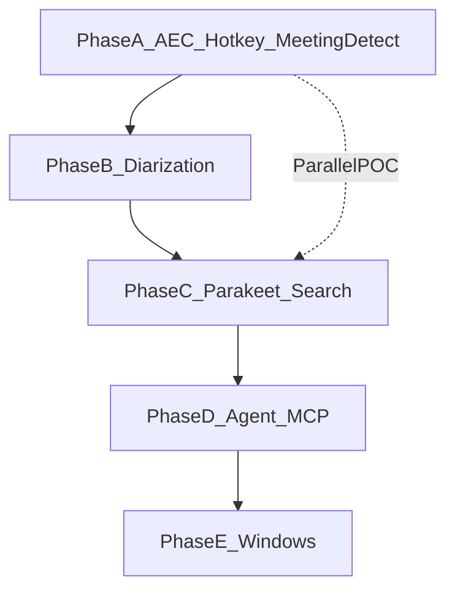

# KatipAI × OpenWhispr — Integration roadmap

> **Status:** Approved — implement phase by phase
> **Last updated:** 2026-07-05
> **Reference:** [OpenWhispr](https://github.com/OpenWhispr/openwhispr)

---

## Fixed decisions

| Topic | Choice |
|-------|--------|
| Product identity | Background note assistant (Granola-style) — OpenWhispr features as an extra layer |
| Platform | macOS first → Windows later (Phase E) |
| Models | Fully local (MLX Whisper/Qwen + sherpa-onnx Parakeet) |
| Architecture | Keep the Python core; no Electron fork |
| Process | **Build a phase → test → approve → next phase** |

---

## Current vs target

### Already in KatipAI

- Background VAD (Silero)
- Dual channel: microphone (Me) + system audio (Other)
- MLX Whisper STT + Qwen LLM summaries
- Echo dedup (audio-separation Phase 0)
- Per-app system audio (Phase 1)
- Voice profile / voice match (Phase 2)
- Obsidian vault export
- Web UI + menu-bar tray + `katipai` supervisor
- Permissions panel (macOS)

### To take from OpenWhispr

- Global hotkey (quick note)
- Automatic meeting detection
- Speaker diarization
- WebRTC AEC3
- Parakeet STT (sherpa-onnx)
- Semantic search
- MCP server
- Local AI agent
- Cross-platform (Windows)



---

## Loop for every phase

1. **Design** — API + DB schema + UI (1–2 days)
2. **Implement** — backend → API → UI → tray
3. **Test gate** — manual scenario checklist + `katipai doctor`
4. **Demo** — user approval
5. **Tag** — `v0.x-phase-X` note

### Test environment

```bash
katipai doctor && katipai up --all
tail -f ~/.katipai/run/logs/core.log
```

---

## Phase A — Audio quality + hotkey + meeting detect

**Duration:** 4–6 weeks
**Goal:** Reliable capture for music+speech and meetings; quick notes.

### A1 — Better echo cancellation (WebRTC AEC3)

| | |
|---|---|
| **OpenWhispr reference** | `native/meeting-aec-helper` (WebRTC AEC3 sidecar) |
| **New files** | `core/audio/aec.py`, `tools/aec_helper/` (Swift/C++ wrapper) |
| **Update** | `core/audio/dedup.py` (pipeline: AEC → correlation dedup), `core/audio/recorder.py` |
| **Settings** | `aec_enabled`, `aec_mode: webrtc\|correlation\|both` |
| **Fallback** | If the AEC helper is missing, keep correlation dedup (`echo_correlation_threshold`) |

### A2 — Global hotkey (quick note)

Unlike OpenWhispr dictation: **no paste at the cursor** — the note goes to the timeline/vault.

| | |
|---|---|
| **New files** | `core/hotkey/listener.py`, `core/audio/quick_recorder.py`, `core/api/routes/quick_note.py`, `apps/web/src/components/HotkeySettings.jsx` |
| **API** | `POST /api/quick-note/start`, `POST /api/quick-note/stop` |
| **Behavior** | Tap-to-talk: start once, stop once (max 60 s) |
| **Tray** | Hotkey status indicator |
| **Settings** | `hotkey_enabled`, `hotkey_combo` (default: `ctrl+shift+k`) |
| **Permission** | macOS Accessibility — extend `PermissionsPanel` |

### A3 — Auto-pause media

| | |
|---|---|
| **New file** | `core/audio/media_control.py` — AppleScript / `osascript` (Spotify, Music) |
| **Behavior** | Pause when hotkey or manual record starts; resume when it ends |
| **Setting** | `auto_pause_media: bool` |

### A4 — Automatic meeting detection

| | |
|---|---|
| **New files** | `core/meeting/detector.py`, `core/api/routes/meeting.py` |
| **Watched apps** | `com.microsoft.teams2`, `us.zoom.xos`, `com.apple.FaceTime`, `com.google.Chrome` (Meet) |
| **Mechanism** | `psutil` process scan + optional mic-activity spike |
| **API** | `GET /api/meeting/status`, `POST /api/meeting/accept`, `POST /api/meeting/dismiss` |
| **Tray** | macOS notification: "Meeting detected — start recording?" |
| **Settings** | `meeting_auto_detect`, `meeting_auto_start: bool` |

### Phase A — Test gate

| # | Scenario | Expected |
|---|---------|----------|
| A-T1 | Spotify on speakers + speech | Mic echo chunks filtered; system recording remains |
| A-T2 | Hotkey → 10 s speech → release | New transcript on the timeline in < 15 s |
| A-T3 | Hotkey while Spotify plays | Music pauses, then resumes |
| A-T4 | Open Teams | Tray prompt; Accept → meeting mode + app capture |
| A-T5 | `katipai doctor` | All checks pass |

**Approval:** A-T1, A-T2, and A-T4 must pass.

---

## Phase B — Meeting intelligence + diarization

**Duration:** 6–8 weeks
**Goal:** Separate 3–6 people in a meeting; go beyond Me vs Other.
**Prerequisite:** Phase A approved (especially AEC + meeting detect)

### B1 — Meeting session model

- DB: `core/db/models.py`
  - `Meeting` table: `app`, `started_at`, `expected_speakers`, `calendar_title` (optional)
  - Active use of `Chunk.speaker_id` FK
  - `Speaker.embedding` blob — cross-meeting fingerprint
- New: `core/meeting/session.py` — meeting lifecycle

### B2 — Speaker diarization (local)

| | |
|---|---|
| **OpenWhispr reference** | Live + post-processing clustering, voice fingerprints |
| **New file** | `core/audio/diarization.py` |
| **Stack** | sherpa-onnx speaker embedding + clustering; extend current `voice_profile.py` ONNX |
| **Chunking** | In meeting mode, `silence_chunk_ms` 4–5 s (discussion) |
| **Pipeline** | `core/pipeline/note_pipeline.py` — segment-based STT |

### B3 — Speaker management UI

- New: `apps/web/src/pages/Meeting.jsx` — live meeting view
- Timeline: speaker color badges, rename
- API: `PATCH /api/speakers/{id}` — update `display_name`
- "1 other in call" stepper (inspired by OpenWhispr pill UI)

### B4 — Cross-meeting voice fingerprints

- Enrollment for multiple speaker profiles
- Known speakers auto-labeled in later meetings
- Cross-check the existing "Me" profile against system + mic

### Phase B — Test gate

| # | Scenario | Expected |
|---|---------|----------|
| B-T1 | Simulated Teams meeting (2–3 people) | At least two speaker labels |
| B-T2 | "Me" speaks | Mic + system cross-check → "Me" label |
| B-T3 | Wrong label → fix in UI | Correction sticks on later chunks |
| B-T4 | 30-minute meeting | Session summary + speaker list in the vault |

**Approval:** B-T1 and B-T2 must pass.

---

## Phase C — Fast STT + semantic search

**Duration:** 4–6 weeks
**Goal:** Instant hotkey response; semantic search over past notes.
**Prerequisite:** Phase B approved (stable diarization pipeline)

### C1 — Parakeet STT (sherpa-onnx)

| | |
|---|---|
| **OpenWhispr reference** | NVIDIA Parakeet via sherpa-onnx |
| **New files** | `core/stt/parakeet.py`, `scripts/download_parakeet_model.py` |
| **Abstraction** | `core/stt/transcriber.py` → `STTEngine` protocol |
| **Implementations** | `MLXWhisperEngine`, `ParakeetEngine` |
| **Setting** | `stt_engine: whisper\|parakeet\|auto` — hotkey → Parakeet, background → Whisper |
| **RAM** | ModelManager: load Parakeet and Whisper sequentially |

### C2 — STT benchmark suite

- New: `scripts/benchmark_stt.py`
- Metrics: latency, WER (Turkish test set), peak RAM
- Docs: which engine for which scenario

### C3 — Semantic search (local)

| | |
|---|---|
| **OpenWhispr reference** | Hybrid semantic + full-text search |
| **New files** | `core/search/embeddings.py`, `core/search/index.py` |
| **Embedding** | ONNX (existing speaker-model stack or `all-MiniLM` ONNX) |
| **Index** | sqlite-vec or a numpy cosine index |
| **DB** | `transcript_embeddings` table |
| **Pipeline** | Index an embedding when a transcript completes |
| **API** | `GET /api/search?q=...&mode=semantic\|text\|hybrid` |
| **UI** | `apps/web/src/pages/Search.jsx` — global search bar |

### Phase C — Test gate

| # | Scenario | Expected |
|---|---------|----------|
| C-T1 | Hotkey, 5 s of speech | Parakeet STT < 3 s (M1 Pro) |
| C-T2 | Background listening | Whisper is used (auto mode) |
| C-T3 | Search "petrol in today's meeting" | Matching transcripts rank first |
| C-T4 | Benchmark script | Parakeet vs Whisper report |

**Approval:** C-T1 and C-T3 must pass.

---

## Phase D — Local AI agent + MCP

**Duration:** 6–8 weeks
**Goal:** Voice commands to search/create notes; Cursor integration.
**Prerequisite:** Phase C approved (semantic search works)

### D1 — Agent tool framework

- New: `core/agent/tools.py`
  ```python
  # Tools: search_transcripts, search_semantic, create_note,
  #        summarize_session, add_jargon, get_timeline_today
  ```
- New: `core/agent/runner.py` — MLX Qwen tool-calling loop
- Extend current `core/llm/summarizer.py`

### D2 — Agent UI + hotkey

| | |
|---|---|
| **OpenWhispr reference** | Agent overlay, streaming responses |
| **New file** | `apps/web/src/components/AgentPanel.jsx` — streaming chat overlay |
| **Hotkey** | `ctrl+shift+a` — agent mode (voice → command → reply) |
| **Setting** | Configurable agent name ("Katip", "Jarvis") |
| **DB** | `agent_sessions` table |

### D3 — MCP server

| | |
|---|---|
| **OpenWhispr reference** | [MCP integration](https://docs.openwhispr.com/integrations/mcp.md) |
| **New file** | `core/mcp/server.py` — `mcp` Python package |
| **Tools** | search, notes, transcripts, sessions, jargon |
| **Transport** | Stdio: `katipai mcp` CLI command |
| **Docs** | `docs/mcp-setup.md` — Cursor `~/.cursor/mcp.json` example |

### D4 — Agent API

- `POST /api/agent/chat` — text input, streaming SSE
- `POST /api/agent/voice` — audio → STT → agent → response
- WebSocket agent events

### Phase D — Test gate

| # | Scenario | Expected |
|---|---------|----------|
| D-T1 | "Summarize today's meeting" (voice) | Agent finds the right session + summary |
| D-T2 | "New note: deploy tomorrow" | Appended to general notes or the vault |
| D-T3 | Cursor MCP connection | `search_transcripts` tool works |
| D-T4 | Agent hotkey, 5 commands | Streaming reply < 10 s (Qwen 4B) |

**Approval:** D-T1 and D-T3 must pass.

---

## Phase E — Windows + packaging

**Duration:** 8+ weeks (after macOS is done)
**Goal:** Core features on Windows; easy installers.

### E1 — Windows system audio

- New: `core/audio/capture_win.py` — WASAPI loopback
- `core/audio/capture.py` — platform factory
- `app_sources`: Windows process list

### E2 — Windows tray + hotkey

- New: `apps/tray/tray_win.py` — pystray or a tiny Electron shell
- Hotkey: `pynput` Windows backend

### E3 — Installer

- macOS: `.dmg` (PyInstaller or `create-dmg`)
- Windows: `.exe` (PyInstaller + Inno Setup)
- `katipai doctor` platform-specific checks

### E4 — Feature parity matrix

| Feature | macOS | Windows |
|---------|-------|---------|
| Background listening | Full | Mic only (v1) |
| System audio | ScreenCaptureKit | WASAPI |
| AEC | WebRTC native | Correlation only (v1) |
| Diarization | Full | Full |
| Hotkey | Full | Full |
| MCP | Full | Full |

### Phase E — Test gate

| # | Scenario | Expected |
|---|---------|----------|
| E-T1 | Install on Windows 10/11 | `katipai up --all` runs |
| E-T2 | Mic + hotkey | A transcript is produced |
| E-T3 | macOS `.dmg` install | First setup < 5 minutes |

---

## File / module map (all phases)

```
core/
├── audio/
│   ├── aec.py              # Phase A
│   ├── media_control.py    # Phase A
│   ├── quick_recorder.py   # Phase A
│   ├── diarization.py      # Phase B
│   └── capture_win.py      # Phase E
├── hotkey/
│   └── listener.py         # Phase A
├── meeting/
│   ├── detector.py         # Phase A
│   └── session.py          # Phase B
├── stt/
│   ├── parakeet.py         # Phase C
│   └── engine.py           # Phase C (abstraction)
├── search/
│   ├── embeddings.py       # Phase C
│   └── index.py            # Phase C
├── agent/
│   ├── tools.py            # Phase D
│   └── runner.py           # Phase D
└── mcp/
    └── server.py           # Phase D

tools/
├── aec_helper/             # Phase A (Swift/C++)
└── system_audio/           # existing

apps/web/src/
├── components/
│   ├── HotkeySettings.jsx  # Phase A
│   └── AgentPanel.jsx      # Phase D
└── pages/
    ├── Meeting.jsx         # Phase B
    └── Search.jsx          # Phase C
```

---

## Dependency graph



- Do not start B before A is finished.
- A Parakeet POC in Phase C can start in parallel with the Phase A hotkey.

---

## Rough calendar

| Phase | Duration | Cumulative |
|-------|----------|------------|
| A | 4–6 weeks | ~1.5 months |
| B | 6–8 weeks | ~3.5 months |
| C | 4–6 weeks | ~5 months |
| D | 6–8 weeks | ~7 months |
| E | 8+ weeks | ~9–12 months |

---

## Phase completion template

Fill this in at the end of every phase:

```markdown
## Phase X — Completion report
- [ ] Test-gate scenarios passed
- [ ] katipai doctor is clean
- [ ] README / settings docs updated
- [ ] New dependencies in pyproject.toml
- [ ] Migration script ran
- [ ] User demo approved
```

---

## First step: Phase A Sprint 1 (weeks 1–2)

1. `core/meeting/detector.py` + tray notification **(A4)**
2. `core/hotkey/listener.py` + quick-note API **(A2)**
3. Review OpenWhispr `meeting-aec-helper` sources → AEC POC decision **(A1)**
4. Accessibility hotkey permission on PermissionsPanel **(A2)**

**Sprint 1 MVP test:** A-T4 (meeting detect) + A-T2 (hotkey)

After approval, Sprint 2: AEC + media pause (A1, A3)

---

## Related current files

| Area | Path |
|------|------|
| Recorder / audio | `core/audio/recorder.py`, `chunker.py`, `dedup.py`, `voice_profile.py`, `app_sources.py` |
| API routes | `core/api/routes/status.py`, `audio.py`, `voice.py`, `permissions.py`, `settings.py` |
| Supervisor | `core/supervisor.py`, `core/cli.py` |
| Web UI | `apps/web/src/pages/Settings.jsx`, `components/ControlPanel.jsx`, `PermissionsPanel.jsx`, `AudioSourcePicker.jsx`, `VoiceProfileSection.jsx` |
| Tray | `apps/tray/tray_app.py` |
| Swift helper | `tools/system_audio/Sources/main.swift` |
