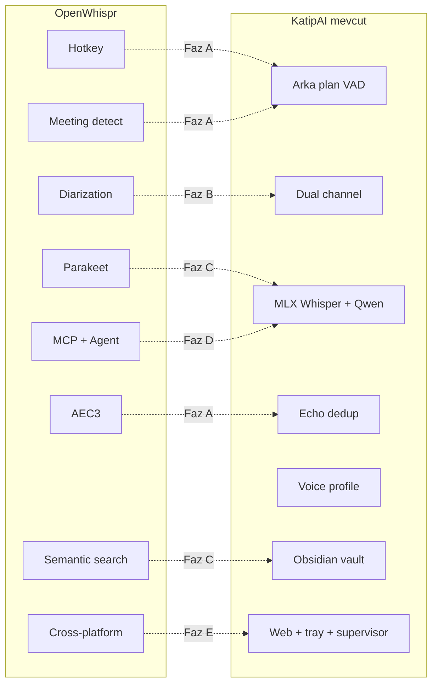
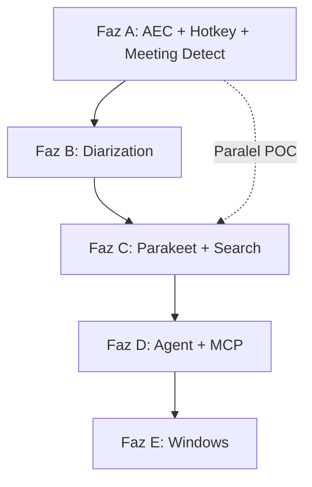

# KatipAI × OpenWhispr — Tam Entegrasyon Planı

> **Durum:** Onaylandı — faz faz uygulanacak  
> **Son güncelleme:** 2026-07-05  
> **Referans:** [OpenWhispr](https://github.com/OpenWhispr/openwhispr)

---

## Sabit kararlar

| Konu | Seçim |
|------|-------|
| Ürün kimliği | Arka plan not asistanı (Granola) — OpenWhispr özellikleri ek katman |
| Platform | macOS önce → Windows sonra (Faz E) |
| Modeller | Tamamen lokal (MLX Whisper/Qwen + sherpa-onnx Parakeet) |
| Mimari | Python core korunur; Electron fork yok |
| Uygulama | **Faz faz geliştir → test et → onayla → sonraki faz** |

---

## Mevcut durum vs hedef

### KatipAI'de zaten var

- Arka plan VAD (Silero)
- Çift kanal: mikrofon (Ben) + sistem sesi (Diğer)
- MLX Whisper STT + Qwen LLM özet
- Echo dedup (Ses Ayrımı Faz 0)
- Uygulama bazlı system audio (Faz 1)
- Ses profili / voice match (Faz 2)
- Obsidian vault export
- Web UI + menü bar tray + `katipai` supervisor
- İzinler paneli (macOS)

### OpenWhispr'dan eklenecek

- Global hotkey (hızlı not)
- Toplantı otomatik algılama
- Speaker diarization
- WebRTC AEC3
- Parakeet STT (sherpa-onnx)
- Semantik arama
- MCP server
- Lokal AI agent
- Cross-platform (Windows)



---

## Her faz için uygulama döngüsü

1. **Design** — API + DB şema + UI (1–2 gün)
2. **Implement** — backend → API → UI → tray
3. **Test gate** — manuel senaryo checklist + `katipai doctor`
4. **Demo** — kullanıcı onayı
5. **Tag** — `v0.x-faz-X` notu

### Test ortamı

```bash
katipai doctor && katipai up --all
tail -f ~/.katipai/run/logs/core.log
```

---

## Faz A — Ses kalitesi + Hotkey + Toplantı algılama

**Süre:** 4–6 hafta  
**Hedef:** Müzik+konuşma ve toplantı senaryolarında güvenilir kayıt; hızlı not alma.

### A1 — Gelişmiş echo iptali (WebRTC AEC3)

| | |
|---|---|
| **OpenWhispr referansı** | `native/meeting-aec-helper` (WebRTC AEC3 sidecar) |
| **Yeni dosyalar** | `core/audio/aec.py`, `tools/aec_helper/` (Swift/C++ wrapper) |
| **Güncelleme** | `core/audio/dedup.py` (pipeline: AEC → correlation dedup), `core/audio/recorder.py` |
| **Ayarlar** | `aec_enabled`, `aec_mode: webrtc\|correlation\|both` |
| **Fallback** | AEC helper yoksa mevcut correlation dedup (`echo_correlation_threshold`) |

### A2 — Global hotkey (hızlı not)

OpenWhispr dictation'dan fark: **cursor'a yapıştırma yok** — timeline/vault'a eklenir.

| | |
|---|---|
| **Yeni dosyalar** | `core/hotkey/listener.py`, `core/audio/quick_recorder.py`, `core/api/routes/quick_note.py`, `apps/web/src/components/HotkeySettings.jsx` |
| **API** | `POST /api/quick-note/start`, `POST /api/quick-note/stop` |
| **Davranış** | Tap-to-talk: bir kez başlat, bir kez durdur (max 60 sn) |
| **Tray** | Hotkey durumu göstergesi |
| **Ayarlar** | `hotkey_enabled`, `hotkey_combo` (varsayılan: `ctrl+shift+k`) |
| **İzin** | macOS Accessibility — `PermissionsPanel` genişletilir |

### A3 — Medya otomatik duraklatma

| | |
|---|---|
| **Yeni dosya** | `core/audio/media_control.py` — AppleScript / `osascript` (Spotify, Music) |
| **Davranış** | Hotkey veya manuel kayıt başlayınca pause, bitince resume |
| **Ayar** | `auto_pause_media: bool` |

### A4 — Toplantı otomatik algılama

| | |
|---|---|
| **Yeni dosyalar** | `core/meeting/detector.py`, `core/api/routes/meeting.py` |
| **İzlenen uygulamalar** | `com.microsoft.teams2`, `us.zoom.xos`, `com.apple.FaceTime`, `com.google.Chrome` (Meet) |
| **Mekanizma** | `psutil` process scan + opsiyonel mic activity spike |
| **API** | `GET /api/meeting/status`, `POST /api/meeting/accept`, `POST /api/meeting/dismiss` |
| **Tray** | macOS bildirimi: "Toplantı algılandı — kayda başla?" |
| **Ayarlar** | `meeting_auto_detect`, `meeting_auto_start: bool` |

### Faz A — Test gate

| # | Senaryo | Beklenen |
|---|---------|----------|
| A-T1 | Hoparlörden Spotify + konuşma | Mic echo chunk'ları filtrelenir; system kaydı kalır |
| A-T2 | Hotkey → 10 sn konuş → bırak | Timeline'da yeni transcript < 15 sn |
| A-T3 | Spotify çalarken hotkey | Müzik duraklar, biter bitince devam |
| A-T4 | Teams aç | Tray bildirimi; Accept → meeting modu + app capture |
| A-T5 | `katipai doctor` | Tüm kontroller geçer |

**Onay kriteri:** A-T1, A-T2, A-T4 geçmeli.

---

## Faz B — Toplantı zekası + Diarization

**Süre:** 6–8 hafta  
**Hedef:** Toplantıda 3–6 kişiyi ayır; "Ben" vs "Diğer" ötesine geç.  
**Önkoşul:** Faz A onaylı (özellikle AEC + meeting detect)

### B1 — Toplantı oturum modeli

- DB: `core/db/models.py`
  - `Meeting` tablosu: `app`, `started_at`, `expected_speakers`, `calendar_title` (opsiyonel)
  - `Chunk.speaker_id` FK aktif kullanım
  - `Speaker.embedding` blob — cross-meeting fingerprint
- Yeni: `core/meeting/session.py` — meeting lifecycle

### B2 — Speaker diarization (lokal)

| | |
|---|---|
| **OpenWhispr referansı** | Live + post-processing clustering, voice fingerprints |
| **Yeni dosya** | `core/audio/diarization.py` |
| **Altyapı** | sherpa-onnx speaker embedding + clustering; mevcut `voice_profile.py` ONNX genişletilir |
| **Chunking** | Meeting modunda `silence_chunk_ms` 4–5 sn (tartışma için) |
| **Pipeline** | `core/pipeline/note_pipeline.py` — segment bazlı STT |

### B3 — Konuşmacı yönetimi UI

- Yeni: `apps/web/src/pages/Meeting.jsx` — canlı toplantı görünümü
- Timeline: konuşmacı renk badge'leri, isim düzenleme
- API: `PATCH /api/speakers/{id}` — display_name güncelle
- "1 other in call" stepper (OpenWhispr pill UI'dan ilham)

### B4 — Voice fingerprint cross-meeting

- Enrollment genişletme: birden fazla konuşmacı profili
- Tanınan konuşmacılar sonraki toplantılarda otomatik etiket
- Mevcut ses profili ("Ben") ile system+mic cross-check

### Faz B — Test gate

| # | Senaryo | Beklenen |
|---|---------|----------|
| B-T1 | Teams toplantısı simülasyonu (2–3 kişi) | En az 2 farklı speaker label |
| B-T2 | "Ben" konuşunca | Mic + system cross-check → "Ben" etiketi |
| B-T3 | Yanlış etiket → UI'den düzelt | Sonraki chunk'larda düzeltme kalıcı |
| B-T4 | 30 dk toplantı | Oturum özeti + konuşmacı listesi vault'ta |

**Onay kriteri:** B-T1, B-T2 geçmeli.

---

## Faz C — Hızlı STT + Semantik arama

**Süre:** 4–6 hafta  
**Hedef:** Hotkey anında yanıt; geçmiş notlarda anlamsal arama.  
**Önkoşul:** Faz B onaylı (diarization pipeline stabil)

### C1 — Parakeet STT (sherpa-onnx)

| | |
|---|---|
| **OpenWhispr referansı** | NVIDIA Parakeet via sherpa-onnx |
| **Yeni dosyalar** | `core/stt/parakeet.py`, `scripts/download_parakeet_model.py` |
| **Abstraction** | `core/stt/transcriber.py` → `STTEngine` protocol |
| **Implementasyonlar** | `MLXWhisperEngine`, `ParakeetEngine` |
| **Ayar** | `stt_engine: whisper\|parakeet\|auto` — hotkey → Parakeet, arka plan → Whisper |
| **RAM** | ModelManager: Parakeet + Whisper sıralı yükleme |

### C2 — STT benchmark suite

- Yeni: `scripts/benchmark_stt.py`
- Metrikler: latency, WER (Türkçe test set), RAM peak
- Dokümantasyon: hangi senaryoda hangi engine

### C3 — Semantik arama (lokal)

| | |
|---|---|
| **OpenWhispr referansı** | Hybrid semantic + full-text search |
| **Yeni dosyalar** | `core/search/embeddings.py`, `core/search/index.py` |
| **Embedding** | ONNX (mevcut speaker model altyapısı veya `all-MiniLM` ONNX) |
| **Index** | sqlite-vec veya numpy cosine index |
| **DB** | `transcript_embeddings` tablosu |
| **Pipeline** | Transcript tamamlanınca embedding indexle |
| **API** | `GET /api/search?q=...&mode=semantic\|text\|hybrid` |
| **UI** | `apps/web/src/pages/Search.jsx` — global arama çubuğu |

### Faz C — Test gate

| # | Senaryo | Beklenen |
|---|---------|----------|
| C-T1 | Hotkey 5 sn konuşma | Parakeet < 3 sn STT (M1 Pro) |
| C-T2 | Arka plan dinleme | Whisper kullanılır (auto mod) |
| C-T3 | "Bugün toplantıda petrol" ara | İlgili transcript'ler sıralanır |
| C-T4 | Benchmark script | Parakeet vs Whisper raporu |

**Onay kriteri:** C-T1, C-T3 geçmeli.

---

## Faz D — Lokal AI Agent + MCP

**Süre:** 6–8 hafta  
**Hedef:** Sesli komutlarla not arama/oluşturma; Cursor entegrasyonu.  
**Önkoşul:** Faz C onaylı (semantic search çalışır)

### D1 — Agent tool framework

- Yeni: `core/agent/tools.py`
  ```python
  # Tools: search_transcripts, search_semantic, create_note,
  #        summarize_session, add_jargon, get_timeline_today
  ```
- Yeni: `core/agent/runner.py` — MLX Qwen tool-calling loop
- Mevcut `core/llm/summarizer.py` genişletilir

### D2 — Agent UI + hotkey

| | |
|---|---|
| **OpenWhispr referansı** | Agent overlay, streaming responses |
| **Yeni dosya** | `apps/web/src/components/AgentPanel.jsx` — streaming chat overlay |
| **Hotkey** | `ctrl+shift+a` — agent modu (ses → komut → yanıt) |
| **Ayar** | Agent adı ayarlanabilir ("Katip", "Jarvis") |
| **DB** | `agent_sessions` tablosu |

### D3 — MCP server

| | |
|---|---|
| **OpenWhispr referansı** | [MCP integration](https://docs.openwhispr.com/integrations/mcp.md) |
| **Yeni dosya** | `core/mcp/server.py` — `mcp` Python package |
| **Tools** | search, notes, transcripts, sessions, jargon |
| **Transport** | Stdio: `katipai mcp` CLI komutu |
| **Dokümantasyon** | `docs/mcp-setup.md` — Cursor `~/.cursor/mcp.json` örneği |

### D4 — Agent API

- `POST /api/agent/chat` — text input, streaming SSE
- `POST /api/agent/voice` — audio → STT → agent → response
- WebSocket agent events

### Faz D — Test gate

| # | Senaryo | Beklenen |
|---|---------|----------|
| D-T1 | "Bugünkü toplantıyı özetle" (sesli) | Agent doğru session'ı bulur + özet |
| D-T2 | "Yeni not: yarın deploy var" | general notes veya vault'a eklenir |
| D-T3 | Cursor MCP bağlantısı | `search_transcripts` tool çalışır |
| D-T4 | Agent hotkey 5 komut | Streaming yanıt < 10 sn (Qwen 4B) |

**Onay kriteri:** D-T1, D-T3 geçmeli.

---

## Faz E — Windows + Paketleme

**Süre:** 8+ hafta (macOS tamamlandıktan sonra)  
**Hedef:** Windows'ta temel özellikler; kolay kurulum.

### E1 — Windows system audio

- Yeni: `core/audio/capture_win.py` — WASAPI loopback
- `core/audio/capture.py` — platform factory
- `app_sources`: Windows process listesi

### E2 — Windows tray + hotkey

- Yeni: `apps/tray/tray_win.py` — pystray veya Electron mini shell
- Hotkey: `pynput` Windows backend

### E3 — Installer

- macOS: `.dmg` (PyInstaller veya `create-dmg`)
- Windows: `.exe` (PyInstaller + Inno Setup)
- `katipai doctor` platform-specific checks

### E4 — Feature parity matrix

| Özellik | macOS | Windows |
|---------|-------|---------|
| Arka plan dinleme | Full | Mic only (v1) |
| System audio | ScreenCaptureKit | WASAPI |
| AEC | WebRTC native | Correlation only (v1) |
| Diarization | Full | Full |
| Hotkey | Full | Full |
| MCP | Full | Full |

### Faz E — Test gate

| # | Senaryo | Beklenen |
|---|---------|----------|
| E-T1 | Windows 10/11 kurulum | `katipai up --all` çalışır |
| E-T2 | Mic + hotkey | Transcript oluşur |
| E-T3 | macOS `.dmg` install | İlk kurulum < 5 dk |

---

## Dosya / modül haritası (tüm fazlar)

```
core/
├── audio/
│   ├── aec.py              # Faz A
│   ├── media_control.py    # Faz A
│   ├── quick_recorder.py   # Faz A
│   ├── diarization.py      # Faz B
│   └── capture_win.py      # Faz E
├── hotkey/
│   └── listener.py         # Faz A
├── meeting/
│   ├── detector.py         # Faz A
│   └── session.py          # Faz B
├── stt/
│   ├── parakeet.py         # Faz C
│   └── engine.py           # Faz C (abstraction)
├── search/
│   ├── embeddings.py       # Faz C
│   └── index.py            # Faz C
├── agent/
│   ├── tools.py            # Faz D
│   └── runner.py           # Faz D
└── mcp/
    └── server.py           # Faz D

tools/
├── aec_helper/             # Faz A (Swift/C++)
└── system_audio/           # mevcut

apps/web/src/
├── components/
│   ├── HotkeySettings.jsx  # Faz A
│   └── AgentPanel.jsx      # Faz D
└── pages/
    ├── Meeting.jsx         # Faz B
    └── Search.jsx          # Faz C
```

---

## Bağımlılık grafiği



- Faz A bitmeden B'ye geçilmez.
- Faz C'de Parakeet POC, Faz A hotkey ile paralel başlayabilir.

---

## Tahmini takvim

| Faz | Süre | Kümülatif |
|-----|------|-----------|
| A | 4–6 hafta | ~1.5 ay |
| B | 6–8 hafta | ~3.5 ay |
| C | 4–6 hafta | ~5 ay |
| D | 6–8 hafta | ~7 ay |
| E | 8+ hafta | ~9–12 ay |

---

## Faz tamamlanma şablonu

Her faz sonunda doldurulacak:

```markdown
## Faz X — Tamamlanma Raporu
- [ ] Test gate senaryoları geçti
- [ ] katipai doctor temiz
- [ ] README / ayar docs güncellendi
- [ ] Yeni bağımlılıklar pyproject.toml'da
- [ ] Migration script çalıştırıldı
- [ ] Kullanıcı demo onayı
```

---

## İlk adım: Faz A Sprint 1 (hafta 1–2)

1. `core/meeting/detector.py` + tray bildirimi **(A4)**
2. `core/hotkey/listener.py` + quick note API **(A2)**
3. OpenWhispr `meeting-aec-helper` kaynak analizi → AEC POC kararı **(A1)**
4. PermissionsPanel'e Accessibility hotkey izni **(A2)**

**Sprint 1 MVP test:** A-T4 (meeting detect) + A-T2 (hotkey)

Onay sonrası Sprint 2: AEC + media pause (A1, A3)

---

## İlgili mevcut dosyalar

| Alan | Yol |
|------|-----|
| Recorder / audio | `core/audio/recorder.py`, `chunker.py`, `dedup.py`, `voice_profile.py`, `app_sources.py` |
| API routes | `core/api/routes/status.py`, `audio.py`, `voice.py`, `permissions.py`, `settings.py` |
| Supervisor | `core/supervisor.py`, `core/cli.py` |
| Web UI | `apps/web/src/pages/Settings.jsx`, `components/ControlPanel.jsx`, `PermissionsPanel.jsx`, `AudioSourcePicker.jsx`, `VoiceProfileSection.jsx` |
| Tray | `apps/tray/tray_app.py` |
| Swift helper | `tools/system_audio/Sources/main.swift` |
